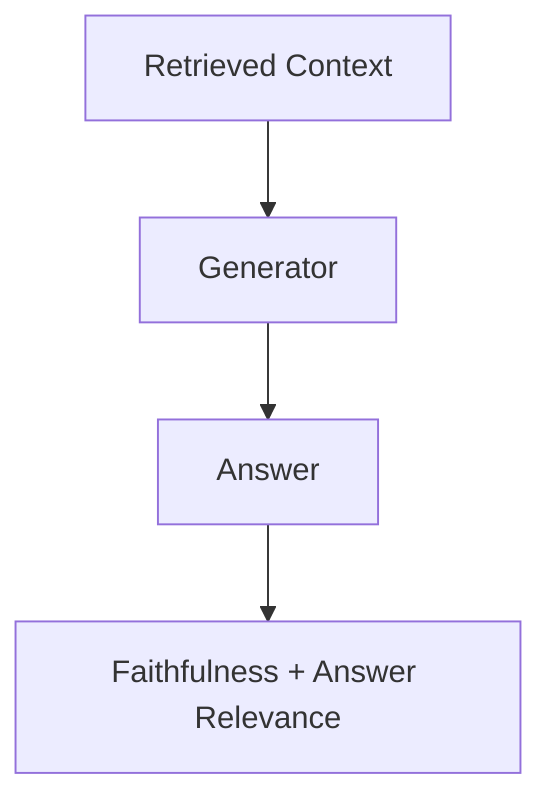

# Groundtruth — Retrieval Evaluation & Regression Harness

A small, self-contained harness for measuring RAG retrieval quality
objectively: a versioned golden dataset, four+ retrieval configurations
evaluated against it, category-level Recall@K / MRR / nDCG, a comparison
report with deltas, an automated CI regression gate, and rule-based error
analysis on the queries that actually fail.

## Problem

Imagine a 60-attorney law firm with 20+ years of case files, opinions,
filings, and research memos, backed by a retrieval-based research
assistant. Every few weeks an engineer changes something — chunk size,
embedding model, dense vs. hybrid retrieval, a reranker — and the only
available answer to "did this help?" is a few people trying some queries
and eyeballing the results. For a system where a missed precedent can be
a serious problem, that isn't good enough. This project builds the
missing piece: an objective, repeatable way to answer that question.

## What This Project Demonstrates

- **A versioned, human-review-gated golden dataset** — not hand-picked
  favorable examples, but a structured set built from templates, then
  validated programmatically before being marked "reviewed."
- **Retrieval metrics computed for real** — Recall@5, Recall@10, MRR, and
  nDCG@10, overall and broken down by query category.
- **Experiment comparison** — the same golden set run against multiple
  retrieval configurations, with deltas relative to a baseline.
- **A CI regression gate** — an automated test that fails the build if
  Recall@10 drops by more than a configurable threshold (default 1
  percentage point) versus an approved baseline.
- **Error analysis** — the worst-performing real queries, with a
  failure reason derived from actual retrieval signals (never invented).
- **Generation evaluation, kept separate from retrieval evaluation** — a
  small generation layer with its own metrics (faithfulness, answer
  relevance), architecturally isolated so the two are never blended into
  one score.

## Architecture

Retrieval evaluation:

```mermaid
flowchart TD
    A[Synthetic Documents] --> B[Corpus / Chunks]
    B --> C[Retrieval Configurations]
    C --> D[Retriever: dense / BM25 / hybrid / reranker]
    D --> E[Top-K Results per Query]
    F[Golden Dataset] --> G[Recall@K / MRR / nDCG]
    E --> G
    G --> H[Comparison Report]
    H --> I[CI Regression Gate]
```

Generation evaluation (deliberately a separate pipeline):



**These two diagrams never merge.** The CI regression gate only ever looks
at Recall@10 from the first pipeline. A generation problem (an unfaithful
or off-target answer) and a retrieval problem (the right document was
never found) are different failures with different fixes, and conflating
them into one score would hide which one you actually have.

## Dataset

`data/corpus.jsonl` and `data/golden_set.jsonl` are **entirely synthetic**
— not real law-firm documents. They are generated by a seeded, template-based
script (`scripts/build_dataset.py`) that builds "clusters" of one legal
doctrine each (across 8 practice areas: contracts, torts, employment, IP,
criminal procedure, evidence, corporate, real estate), and produces up to
four related documents per cluster — an opinion, a statute section, a
procedural filing, and an internal memo. Every golden query is derived from
the same cluster as the passage(s) it targets, so relevance labels are
correct by construction.

- **158 corpus documents**, **100 golden queries**, 20 per category:
  `precedent`, `statute`, `procedural`, `factual`, `multi_hop`.
- `scripts/validate_dataset.py` performs a programmatic review pass
  (referenced passage IDs exist, no duplicate queries, minimum document
  length, category balance) and only then flips each example's
  `review_status` to `"reviewed"`, and writes `data/dataset_meta.json`
  with a `dataset_version`.
- A real deployment would replace this generator's output with an actual
  human-reviewed set of real filings — this project exists to demonstrate
  the *evaluation methodology*, not to provide real legal data. See
  `data/README.md` for the full schema and versioning rules.

## Experiments

Configurations are defined in one place, `src/retrieval/configs.py`:

| Config | Chunk size | Method | Reranker | Candidate pool |
|---|---|---|---|---|
| `baseline` | 300 chars | dense (MiniLM embeddings) | off | full |
| `chunk_change` | 100 chars | dense | off | full |
| `hybrid` | 300 chars | dense + BM25 (Reciprocal Rank Fusion) | off | full |
| `reranker` | 300 chars | dense | cross-encoder reranks top 20 | full |
| `broken` (deliberately bad) | 40 chars | dense | off | clamped to 3 chunks |

`broken` is not a strawman — it's a real configuration, evaluated the same
way as the others, that happens to search only 3 chunks out of the whole
index. Its purpose is to prove the regression gate actually catches a bad
change (see below).

## Metrics

- **Recall@K** — of the passages that are actually relevant to a query,
  what fraction appear anywhere in the top K retrieved? Measures coverage.
- **MRR** (Mean Reciprocal Rank) — the reciprocal of the rank of the first
  relevant result, averaged over queries. Measures how early the right
  answer shows up.
- **nDCG@10** — a rank-sensitive version of Recall@10: hits near the top
  count more than hits near the bottom.

Recall@10 is what the CI gate watches, since it's the metric most directly
tied to "did the system have any chance of answering this correctly at
all" — MRR/nDCG matter for user experience but a system can't compose a
good answer around a document it never retrieved.

## Running Locally

```bash
git clone <this-repo>
cd groundtruth

python3 -m venv .venv
source .venv/bin/activate
pip install -e ".[dev]"

# Build and validate the dataset (already committed, but reproducible):
python scripts/build_dataset.py
python scripts/validate_dataset.py

pytest
```

Then:

```bash
python -m src.evaluation.evaluate
```

Then:

```bash
python -m src.evaluation.error_analysis
```

Optional: to enable Ragas-based generation evaluation instead of the
default lexical heuristic, `pip install -e ".[ragas]"`, set `USE_RAGAS=true`
and provide `ANTHROPIC_API_KEY` or `OPENAI_API_KEY` (see `.env.example`).
Not required for anything else in this repo, including CI.

## CI Regression Gate

`src/evaluation/regression_gate.py` compares a new Recall@10 value against
the committed, approved baseline in `reports/baseline_metrics.json`:

```
drop = new_recall10 - baseline_recall10
PASS if drop >= -threshold   (default threshold: 0.01, i.e. 1 percentage point)
FAIL otherwise
```

`tests/test_regression_gate.py` has an integration test that evaluates
whichever config the `EVAL_CONFIG` environment variable names (default:
`baseline`) against that approved baseline. In normal CI runs this is
green. To reproduce a real, demonstrated failure:

```bash
EVAL_CONFIG=broken pytest tests/test_regression_gate.py
```

Expected result: **FAIL**, with output like:

```
Baseline Recall@10: 0.9850
New Recall@10:      0.0150
Drop:               -0.9700
Allowed threshold:  0.0100
CI RESULT: FAIL
```

`reports/baseline_metrics.json` is only ever updated by
`python -m src.evaluation.evaluate --approve-baseline`, and only after a
human reviews the new numbers — never automatically, and never to make a
failing check pass. The threshold is configurable via `REGRESSION_THRESHOLD`
but defaults to `0.01` and should not be loosened to hide a regression.

`.github/workflows/evaluation.yml` runs: install deps → `pytest` (unit
tests + regression gate, must pass) → full evaluation run → upload the
comparison report as a build artifact. No external LLM calls happen in CI.

## Example Results

These are real numbers from this repository's committed dataset (see
`reports/comparison.md` / `reports/comparison.csv` for the full,
regeneratable output):

| Configuration | Chunk size | Method | Reranker | Recall@5 | Recall@10 | MRR | nDCG@10 | Δ Recall@10 |
|---|---|---|---|---|---|---|---|---|
| baseline | 300 | dense | off | 0.975 | 0.985 | 0.823 | 0.859 | — |
| chunk_change | 100 | dense | off | 0.985 | 0.990 | 0.779 | 0.822 | +0.005 |
| hybrid | 300 | dense+BM25 | off | 0.965 | 1.000 | 0.866 | 0.896 | +0.015 |
| reranker | 300 | dense | on | 0.985 | 0.995 | 0.909 | 0.928 | +0.010 |
| broken | 40 | dense | off | 0.015 | 0.015 | 0.020 | 0.016 | **-0.970** |

Two things worth noticing, honestly:

1. **Recall@10 is close to ceiling for every real configuration.** The
   synthetic golden set is easy enough at K=10 that this metric alone
   barely distinguishes baseline / chunk_change / hybrid / reranker — a
   real motivator for also tracking MRR and nDCG, which do separate them
   clearly (reranker's MRR of 0.909 vs. chunk_change's 0.779 shows a real
   ranking-quality difference that Recall@10 hides).
2. **`chunk_change` (smaller chunks) makes MRR and nDCG worse**, not
   better — fragmenting documents into 100-character windows scatters the
   identifying terms across chunks, so the right document is often found,
   just ranked lower. This is a real regression in ranking quality that
   the harness correctly surfaces, even though Recall@10 alone would call
   it an improvement.

## Error Analysis

Real output from `python -m src.evaluation.error_analysis` against the
`baseline` configuration (full report in `reports/error_analysis.md`):

1. **q003** (factual, easy) — Recall@10: 0.00. The memo answering "what
   key facts were identified concerning consideration" in the Duarte
   Matter was never retrieved. Diagnosis: chunk boundary problem — the
   source memo was split into 6 chunks, and the identifying terms
   (`consideration`, `duarte`) may not be concentrated in any single
   highest-scoring chunk.
2. **q024** (multi_hop, hard) — Recall@10: 0.50. Only one of the two
   required passages (an opinion and a statute on `promissory estoppel`)
   was retrieved — the statute ranked #2, but the opinion was missed
   entirely, a genuine multi-hop failure.
3. **q089** (procedural, hard) — Recall@5: 0.00, Recall@10: 1.00. The
   query names only a generic motion type ("motion to quash subpoena")
   shared by several unrelated filings in the corpus; the correct filing
   was retrieved but only at rank 6, outranked by five other filings of
   the same motion type.
4. **q082** (procedural, hard) — MRR: 0.20. Same pattern as q089: several
   "motion to compel arbitration" filings compete, and the correct one
   ranks 5th.
5. **q029** (procedural, hard) — MRR: 0.25. Same pattern again, ranking
   4th among motion-type look-alikes.

The pattern across 3 of the 5 worst queries — procedural filings that
share a generic motion type — is itself a useful finding: it shows the
retriever leans on motion-type wording more than on the doctrine-specific
content that actually distinguishes one filing from another, which a real
system would want to fix (e.g. by weighting the reranker more heavily for
this document type).

## Design Decisions

- **Real embeddings, not a TF-IDF stand-in.** Dense retrieval uses
  `sentence-transformers/all-MiniLM-L6-v2` so "dense vs. hybrid" is a real
  architectural difference, not two flavors of the same lexical method.
- **Chunking happens on long-form documents.** Each synthetic document is
  300-600 words so chunk-size experiments produce genuinely different
  numbers of chunks, and chunk-boundary failures in error analysis are
  real, not simulated.
- **Golden relevance is document-level, not chunk-level.** Retrieved
  chunks are deduplicated to their parent `passage_id` before scoring,
  since that's the granularity the golden set was labeled at.
- **Hybrid retrieval uses Reciprocal Rank Fusion**, not a tuned weighted
  sum, to keep the combination deterministic and free of an extra
  hyperparameter to justify.
- **Generation evaluation defaults to a free lexical-overlap heuristic**
  (token overlap between answer/context and answer/query) so the full
  pipeline runs with zero API cost and zero network dependency beyond the
  embedding/reranker models. Ragas + an LLM judge is available behind
  `USE_RAGAS=true` for a more rigorous (but paid) alternative.
- **The dataset is template-generated, not freely LLM-authored**, so every
  relevance label is correct by construction and the whole corpus is
  reproducible from a fixed seed.

## Limitations

- **Synthetic corpus.** No real case law, filings, or firm documents are
  used or represented. Absolute metric values here say nothing about
  performance on real legal text.
- **Small dataset.** 100 queries and 158 documents is enough to exercise
  the evaluation methodology, not enough for statistically rigorous
  comparisons between close configurations.
- **Ceiling effects at Recall@10.** As shown above, the golden set is
  "easy" enough that Recall@10 saturates near 1.0 for most configurations;
  a harder or larger dataset would show more differentiation.
- **Retrieval implementation is intentionally lightweight** — no ANN
  index, no production-grade hybrid weighting, no query rewriting. The
  point of this project is the evaluation harness, not a competitive
  search engine.
- **Embedding/reranker model dependency.** Absolute numbers will shift if
  `EMBEDDING_MODEL_NAME` / `RERANKER_MODEL_NAME` change; only relative
  comparisons within a single evaluation run are meaningful.
- **Generation evaluator dependency.** The default heuristic is a cheap
  proxy, not a substitute for an LLM-judged faithfulness/relevance score;
  treat its numbers as directional only.

## Future Improvements

- A larger, human-reviewed (not template-generated) golden dataset.
- A more realistic and larger legal corpus, ideally with real
  distractor density instead of programmatically-clustered documents.
- A stronger, tuned reranker and a proper ANN vector index.
- Statistical significance testing between configurations (the dataset is
  currently too small to support this rigorously).
- Experiment tracking across runs (e.g. a lightweight run log) instead of
  a single overwritten comparison report.
- Distributed / parallelized evaluation for larger datasets.
