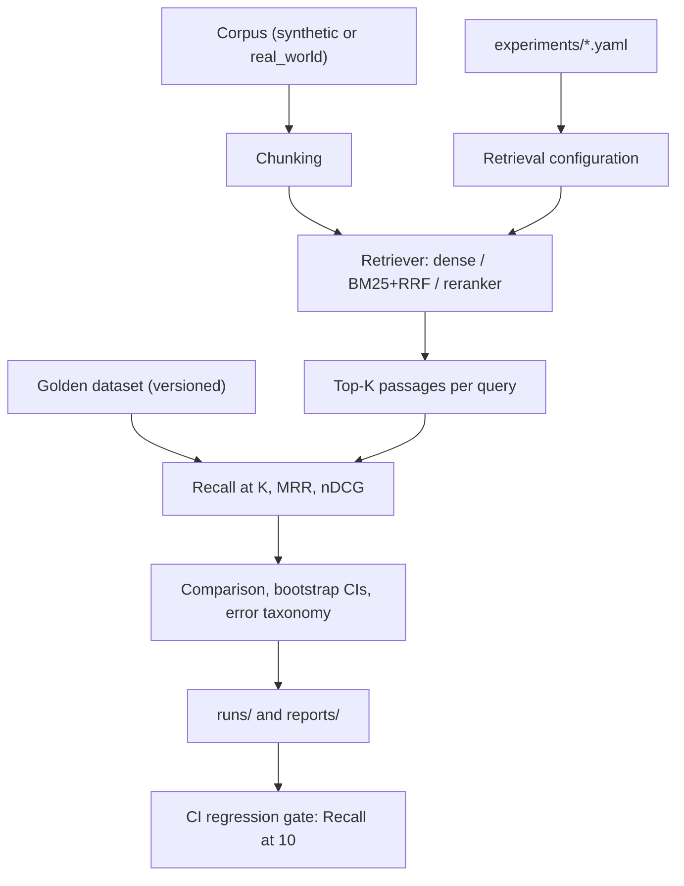
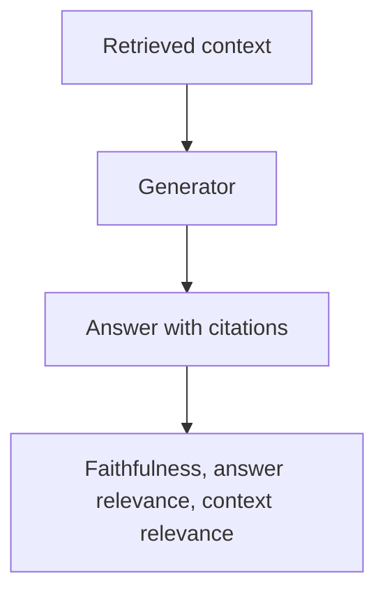
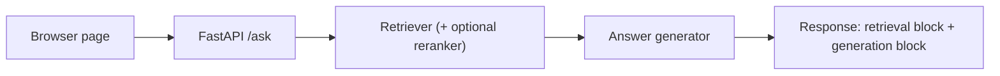

# Groundtruth — Retrieval Evaluation & Regression Harness

Groundtruth measures whether a change to a RAG retrieval pipeline made it better or worse, using a
versioned golden dataset, paired-bootstrap statistics, rule-based failure diagnosis, and a CI gate that
fails the build on a Recall@10 regression. A small RAG demo app shows retrieval and generation side by
side so you can tell which stage caused a bad answer.

> **The main synthetic dataset is fictional.** No real law-firm documents are used. A second, tiny
> benchmark of real public-domain legal text (`data/real_world/`) exists to check generalization. See
> [Limitations](#13-limitations).

## Contents

1. [Problem](#1-problem) · 2. [Why retrieval evaluation matters](#2-why-retrieval-evaluation-matters) ·
3. [Architecture](#3-architecture) · 4. [Dataset methodology](#4-dataset-methodology) ·
5. [Retrieval configurations](#5-retrieval-configurations) · 6. [Metrics](#6-metrics) ·
7. [Statistical methodology](#7-statistical-methodology) · 8. [Error analysis](#8-error-analysis) ·
9. [CI regression gate](#9-ci-regression-gate) · 10. [RAG demonstration](#10-rag-demonstration) ·
11. [Example results](#11-example-results) · 12. [Reproducibility](#12-reproducibility) ·
13. [Limitations](#13-limitations) · 14. [Future work](#14-future-work) ·
15. [How to run locally](#15-how-to-run-locally) · 16. [How to run CI](#16-how-to-run-ci) ·
17. [Project structure](#17-project-structure)

## 1. Problem

A law firm's research assistant retrieves passages from decades of opinions, filings and memos. Every few
weeks someone changes the chunk size, the embedding model, dense vs. hybrid search, or adds a reranker.
"Did that help?" is usually answered by trying a handful of queries by eye. A missed precedent is costly,
and a handful of queries cannot show a regression that affects a specific query type.

## 2. Why retrieval evaluation matters

- **Retrieval failures and generation failures are different problems.** If the right passage is never
  retrieved, no generator can answer correctly; if it is retrieved but the answer is unfaithful, the fix
  is elsewhere. Blending both into one score hides which one you have, so this project never does.
- **Aggregate numbers hide categories.** A change can help statute lookups and hurt multi-hop questions.
- **A higher number is not always a real difference.** With ~100 queries, small deltas can be noise; this
  project reports confidence intervals instead of only point estimates.

## 3. Architecture

Retrieval evaluation:



Generation evaluation (a separate pipeline, never merged with the one above):



RAG demo request flow:



## 4. Dataset methodology

| | `data/synthetic/` | `data/real_world/` |
|---|---|---|
| Purpose | deterministic regression testing (the CI gate uses it) | generalization smoke-check |
| Content | 158 fictional legal-style documents | 12 verbatim public-domain excerpts (8 U.S. opinions, 4 federal rules/statutes) |
| Queries | 100 (20 per category) | 19 (hand-written) |
| Labels | correct by construction (template clusters) | hand-labeled |
| Version | `1.1.0` | `1.0.0` |

- **Synthetic:** `scripts/build_dataset.py` (seeded, `SEED=42`) builds one "cluster" per legal doctrine
  (an opinion, and optionally a statute, filing and memo) and derives each query from the same cluster as
  its target passage. `scripts/validate_dataset.py` is a programmatic review (ids exist, no duplicate
  queries, category balance, minimum length) that sets `review_status` and writes `dataset_meta.json`
  (`dataset_version`, `generator_version`, `seed`, `document_count`, `query_count`, `categories`, …). This
  stands in for human review; a real deployment needs real human review of real filings.
- **Real-world:** U.S. judicial opinions and federal rules/statutes are not subject to copyright. Sources
  and citations are listed in [`data/real_world/README.md`](data/real_world/README.md). Excerpts were
  fetched once and checked in, so no network access is needed. They came through a summarizing fetch tool
  and were **not** proofread character-by-character against official reporters.
- **Versioning:** never edit examples silently; bump `dataset_version` and log why (see each dataset's
  README). Every run records the dataset version, and the regression gate refuses to compare runs from
  different versions.
- **Do not read synthetic absolute metrics as real legal-retrieval performance.**

## 5. Retrieval configurations

Experiments are YAML files in [`experiments/`](experiments/), the single source of truth (loaded by
`src/retrieval/configs.py`):

```yaml
name: hybrid
retrieval: {dense: true, bm25: true, fusion: rrf}
chunking: {size: 300, overlap: 50}
reranker: {enabled: false, model: null, top_n: 20}
candidate_pool: null
```

| Config | Chunk size / overlap | Method | Reranker | Candidate pool |
|---|---|---|---|---|
| `baseline` | 300 / 50 | dense (MiniLM) | off | full |
| `chunk_change` | 100 / 20 | dense | off | full |
| `hybrid` | 300 / 50 | dense + BM25, Reciprocal Rank Fusion | off | full |
| `reranker` | 300 / 50 | dense | cross-encoder over top 20 chunks | full |
| `broken` | 40 / 0 | dense | off | **3 chunks** (deliberately bad) |

Embedding model `sentence-transformers/all-MiniLM-L6-v2`; reranker `cross-encoder/ms-marco-MiniLM-L-6-v2`.
Retrieved chunks are deduplicated to their parent passage before scoring, because labels are document-level.

## 6. Metrics

- **Recall@K** (5 and 10): the fraction of a query's relevant passages found in the top K.
- **MRR:** mean of 1/rank of the first relevant passage.
- **nDCG@10:** rank-sensitive gain with binary relevance (relevant = 1).

Everything is reported overall and per category (`precedent`, `statute`, `procedural`, `factual`,
`multi_hop`). Generation metrics (heuristic unless noted) are kept separate:

| Metric | Default (free, deterministic) | With `USE_RAGAS=true` |
|---|---|---|
| Faithfulness | answer vocabulary found in context | Ragas LLM judge |
| Answer relevance | query vocabulary covered by answer | Ragas LLM judge |
| Context relevance | query vocabulary covered by context | Ragas LLM judge |

The Ragas path is implemented but has **not** been run here (no API key). `pytest` and CI never call an LLM.

## 7. Statistical methodology

Configurations are scored on the same queries, so comparisons are **paired**. `src/evaluation/statistics.py`
resamples queries with replacement (10,000 resamples, seed 42), recomputes the mean per-query difference
each time, and takes the 2.5th/97.5th percentiles as a 95% interval. A difference counts only if the
interval excludes 0; otherwise it is reported as "inconclusive", which means the data cannot separate the
configs, not that they are equal.

```bash
python -m src.evaluation.compare --baseline baseline --candidate hybrid
```

## 8. Error analysis

`python -m src.evaluation.error_analysis` labels every imperfectly retrieved query (Recall@5 < 1,
Recall@10 < 1, or first relevant passage not ranked first) with exactly one of:

`chunk_boundary`, `lexical_mismatch`, `semantic_mismatch`, `distractor_confusion`, `multi_hop_failure`,
`candidate_pool_limitation`, `ranking_failure`, `generic_term_collision`, `unknown`.

Each label comes from computed signals (query/document term overlap, corpus document frequency of query
terms, chunk counts, BM25 rank, candidate-pool size), and each record shows the evidence numbers. Rules are
applied in a fixed order (see `classify_failure`); `unknown` is a genuine fallback. The labels are
heuristics: they describe which signal fired, not a proven root cause. Output includes the per-query
record (ID, category, difficulty, Recall@5/10, MRR, relevant and retrieved IDs, relevant ranks, diagnosis,
evidence), an aggregate table, and `--compare-with <config>` for a side-by-side distribution.

## 9. CI regression gate

```text
drop = new_recall10 - baseline_recall10
PASS if drop >= -threshold        # REGRESSION_THRESHOLD, default 0.01
```

- The approved baseline is `reports/baseline_metrics.json` (Recall@10 `0.985` on synthetic `1.1.0`). It is
  written only by `python -m src.evaluation.evaluate --approve-baseline`, after human review.
- The gate raises clear errors for a missing baseline, an invalid threshold (non-numeric, ≤ 0, NaN/inf), and
  a **dataset-version mismatch** (it will not compare runs from different dataset versions).
- Do not raise the threshold or re-approve the baseline to make a red build green.

Reproduce a genuine failure with the deliberately bad configuration:

```bash
EVAL_CONFIG=broken pytest tests/test_regression_gate.py
```

Expected result: **FAIL** (1 failed, the rest pass), reason: Recall@10 dropped by far more than 1 percentage point:

```text
Baseline Recall@10: 0.9850
New Recall@10:      0.0150
Drop:               -0.9700
Allowed threshold:  0.0100
CI RESULT: FAIL
```

## 10. RAG demonstration

```bash
pip install -e ".[api]"
uvicorn src.api.app:app --reload        # open http://localhost:8000
```

- `POST /retrieve` → ranked passages with scores. `POST /ask` → `{"retrieval": …, "generation": …}`.
- The two blocks are separate on purpose and there is **no combined score**. `generation.context_passage_ids`
  shows exactly what the answer could use; if the question is a golden query, `retrieval.golden_check`
  reports whether the relevant passages were retrieved and at which ranks.
- Answers are extractive by default (no key). `GENERATION_BACKEND=llm` with `ANTHROPIC_API_KEY` uses an
  Anthropic model (needs `pip install anthropic`); that path is **untested against the live API**.
- Try it on `real_world` with *"What warnings must be given to a suspect before custodial questioning?"*:
  Miranda is retrieved at rank 1, but with a 2-source extractive answer the second citation is an
  unrelated procedure rule, showing how a weak second source leaks into the answer.

## 11. Example results

All numbers below come from actual runs of this repository (`reports/comparison.md`,
`reports/dashboard.html`, `reports/real_world/`).

**Synthetic 1.1.0 (100 queries)**

| Config | Recall@5 | Recall@10 | MRR | nDCG@10 | Δ Recall@10 |
|---|---|---|---|---|---|
| baseline | 0.975 | 0.985 | 0.823 | 0.859 | — |
| chunk_change | 0.985 | 0.990 | 0.779 | 0.822 | +0.005 |
| hybrid | 0.965 | 1.000 | 0.866 | 0.896 | +0.015 |
| reranker | 0.985 | 0.995 | 0.909 | 0.928 | +0.010 |
| broken | 0.015 | 0.015 | 0.020 | 0.016 | −0.970 |

**Paired bootstrap vs. baseline (95% CI)**

| Candidate | Recall@10 | MRR | nDCG@10 |
|---|---|---|---|
| chunk_change | +0.005 [−0.015, +0.030] inconclusive | −0.044 [−0.105, +0.018] inconclusive | −0.037 [−0.084, +0.011] inconclusive |
| hybrid | +0.015 [+0.000, +0.040] inconclusive | +0.043 [−0.000, +0.089] inconclusive | +0.037 [+0.004, +0.071] **improvement** |
| reranker | +0.010 [+0.000, +0.030] inconclusive | +0.086 [+0.034, +0.140] **improvement** | +0.069 [+0.030, +0.109] **improvement** |
| broken | −0.970 [−0.995, −0.935] **regression** | −0.803 [−0.860, −0.742] **regression** | −0.843 [−0.888, −0.794] **regression** |

Only the reranker's ranking gains (MRR, nDCG) and the `broken` collapse are clearly separated from noise;
none of the Recall@10 differences among the four real configs is. Recall@10 is near ceiling on this dataset.

**Baseline failure types (30 of 100 queries imperfect)**

| Failure type | Count | % |
|---|---|---|
| semantic_mismatch | 12 | 40% |
| chunk_boundary | 8 | 27% |
| ranking_failure | 6 | 20% |
| distractor_confusion | 2 | 7% |
| multi_hop_failure | 1 | 3% |
| generic_term_collision | 1 | 3% |

Notably, `chunk_change` (100-char chunks) shifts 29 of its 40 imperfect queries to `chunk_boundary`.

**Worst five baseline queries** (`reports/error_analysis.md`): q003 (factual, Recall@10 0.00,
`chunk_boundary`), q024 (multi-hop, only 1 of 2 passages retrieved, `multi_hop_failure`), q089 (procedural,
correct filing at rank 6, `ranking_failure`), q082 (procedural, rank 5, `semantic_mismatch`: BM25 alone
ranks it 4th), q029 (procedural, rank 4, `ranking_failure`). In q089's top five, every result is a
"Motion to Quash Subpoena" filing, a visible pattern, but the classifier's rules did not attribute it to
term collision, so it is reported as the tool labeled it.

**Real-world (12 docs, 19 queries; smoke check, not a benchmark)**

| Config | Recall@10 | MRR | nDCG@10 |
|---|---|---|---|
| baseline | 1.000 | 0.974 | 0.974 |
| chunk_change | 1.000 | 0.877 | 0.911 |
| hybrid | 1.000 | 0.974 | 0.976 |
| reranker | 1.000 | 1.000 | 1.000 |
| broken | 0.053 | 0.053 | 0.053 |

With only 19 queries and short documents, the working configs are effectively tied at ceiling.

## 12. Reproducibility

- Every experiment is a YAML file; `python -m src.evaluation.run --config experiments/hybrid.yaml
  [--dataset synthetic|real_world]` writes `runs/<timestamp>_<name>/` with `config.yaml`, `metrics.json`
  (dataset version, models, chunking, method, candidate pool, timestamp, metrics), `query_results.json`,
  `error_analysis.md`, `report.md`. Runs are never overwritten; `runs/` is git-ignored.
- Dataset generation and bootstrap sampling are seeded. Re-running the same experiment on the same
  dataset on the same machine gives identical metrics (tested). Across hardware, tiny floating-point
  differences in embeddings are possible; the approved numbers were produced on a Mac (Apple GPU), and CI
  runs on Linux CPU. The CI reproduction test uses a 0.005 tolerance for that reason.
- `reports/` holds the latest committed comparison, dashboard and baseline; `runs/` is local history.

## 13. Limitations

- The synthetic corpus is fictional and template-generated; the golden set is small (100) and Recall@10
  is near ceiling, so many configuration differences are statistically inconclusive.
- The real-world benchmark has 12 short excerpts and 19 queries written with knowledge of the text; scores
  are optimistic and not statistically meaningful. Excerpts were not proofread against official sources.
- Retrieval infrastructure is deliberately lightweight (no ANN index, no tuned fusion weights).
- Absolute numbers depend on the embedding/reranker models.
- Heuristic generation metrics are lexical proxies. The Ragas path and the LLM answer backend have not
  been run against a live API here.
- Error-analysis labels are rule-based heuristics.
- Docker: the image built successfully, but running the tests inside the container was **not verified**
  (the host disk filled up during the run).

## 14. Future work

A larger human-reviewed golden set and real firm-style corpus; a larger real-world benchmark;
a stronger reranker and ANN index; experiment tracking beyond local `runs/`; multiple-comparison handling
for many configs; distributed evaluation.

## 15. How to run locally

```bash
git clone git@github.com:Aakif9866/Groundtruth.git && cd Groundtruth
python3 -m venv .venv && source .venv/bin/activate
pip install -e ".[dev,api]"

pytest                                            # all tests
pytest -m unit                                    # fast, no model downloads
python -m src.evaluation.evaluate                 # all configs -> reports/ (+ dashboard.html)
python -m src.evaluation.evaluate --dataset real_world
python -m src.evaluation.run --config experiments/hybrid.yaml --dataset synthetic
python -m src.evaluation.compare --baseline baseline --candidate hybrid
python -m src.evaluation.error_analysis --config baseline --compare-with hybrid
uvicorn src.api.app:app --reload                  # RAG demo
```

First use downloads two small Hugging Face models. Optional: `pip install -e ".[ragas]"` plus
`USE_RAGAS=true` and an API key (see `.env.example`).

**Docker** (`Dockerfile`, `docker-compose.yml`):

```bash
docker compose up                                    # demo on http://localhost:8000
docker compose run --rm app pytest                   # tests
docker compose run --rm app python -m src.evaluation.evaluate
docker compose run --rm -e ANTHROPIC_API_KEY=... -e GENERATION_BACKEND=llm app   # optional LLM answers
```

## 16. How to run CI

`.github/workflows/evaluation.yml` runs on push/PR to `main`: install CPU torch and the package → unit
tests → integration tests → evaluation tests including the regression gate → full evaluation → upload
`comparison.md`, `comparison.csv`, `dashboard.html`. It makes no LLM calls. Its first run on GitHub's
Linux runners has not been observed yet.

## 17. Project structure

```text
experiments/          YAML experiment configs (baseline, chunk_change, hybrid, reranker, broken)
data/synthetic/       fictional corpus + golden set + dataset_meta.json + README
data/real_world/      public-domain excerpts + golden set + sources README
scripts/              build_dataset.py, validate_dataset.py, build_real_world.py
src/retrieval/        configs.py (YAML loader), retriever.py
src/evaluation/       metrics, evaluate, run, compare, statistics, error_analysis, report, regression_gate
src/generation/       generate.py (kept separate from retrieval metrics)
src/api/              FastAPI demo + static page
tests/                unit/, integration/, evaluation/, test_regression_gate.py (the gate entry point)
reports/              baseline_metrics.json (approved), comparison.*, dashboard.html, error_analysis.md
runs/                 local timestamped experiment runs (git-ignored)
```
