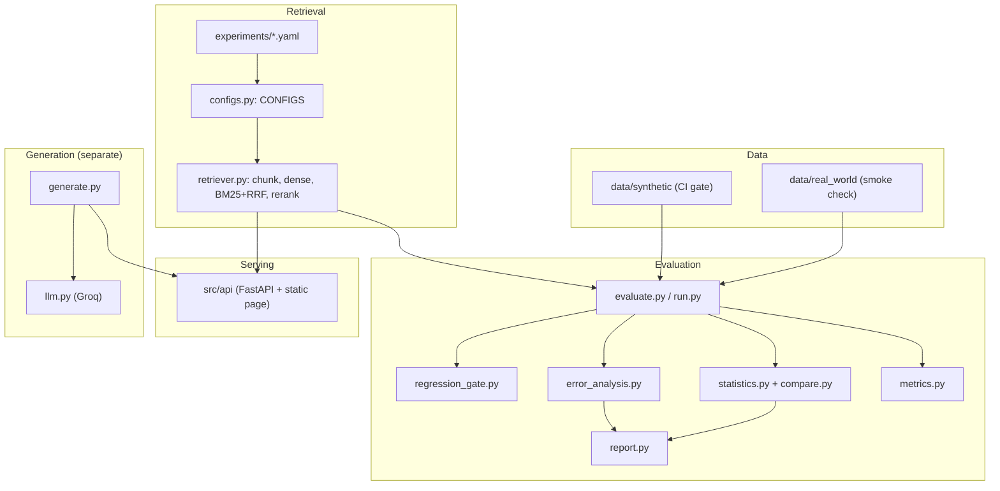

# Architecture

Groundtruth is a small evaluation harness around a lightweight retriever. The retriever is not the product;
the measurement, comparison and regression-gating around it are.

## Layers

The generation box shares nothing with the evaluation box except the tokenizer. Retrieval metrics
(Recall@K, MRR, nDCG) are never combined with generation metrics (faithfulness, answer/context relevance).

## Module map

| Path | Responsibility |
|---|---|
| `experiments/*.yaml` | The only place retrieval configurations are defined. |
| `src/retrieval/configs.py` | Loads and validates the YAML, translates it to the flat dict the retriever uses, exposes `CONFIGS`. |
| `src/retrieval/retriever.py` | Character-window chunking, dense/BM25/hybrid retrieval, cross-encoder reranking, chunk to passage dedup (`retrieve`, `retrieve_scored`). |
| `src/evaluation/metrics.py` | Pure metric functions and category aggregation. |
| `src/evaluation/evaluate.py` | Loads a dataset, runs configs, builds comparison tables, `--approve-baseline`. |
| `src/evaluation/run.py` | One experiment from a YAML into a new `runs/<timestamp>_<name>/` directory. |
| `src/evaluation/statistics.py`, `compare.py` | Paired bootstrap confidence intervals and the comparison CLI. |
| `src/evaluation/error_analysis.py` | Nine-label failure taxonomy, each label derived from computed signals plus evidence. |
| `src/evaluation/report.py` | `comparison.md/csv`, per-run `report.md`, self-contained `dashboard.html`. |
| `src/evaluation/regression_gate.py` | `check_regression`, baseline loading, threshold validation, dataset-version check. |
| `src/generation/generate.py` | Extractive and LLM answers with citations; heuristic and LLM-judge generation metrics. |
| `src/generation/llm.py` | The Groq client (stdlib HTTP). |
| `src/api/` | RAG demo: `/health`, `/retrieve`, `/ask`, and a static page. |
| `scripts/` | Dataset builders and the programmatic validator. |

## Key flows

**Evaluating a config.** Load corpus and golden set for a dataset, build a `Retriever` from a config,
retrieve the top 10 passages per query (chunks deduplicated to parent passage), score each query, aggregate
overall and per category, then (for a comparison) bootstrap each candidate against the baseline and classify
every imperfect query's failure.

**Experiment runs.** `python -m src.evaluation.run --config experiments/X.yaml [--dataset D]` copies the YAML,
writes `metrics.json` (dataset version, models, chunking, method, candidate pool, timestamp, metrics),
`query_results.json`, `error_analysis.md` and `report.md` into a new directory. Existing runs are never
touched.

**Regression gate.** `drop = new_recall10 - baseline_recall10`; pass if `drop >= -threshold`
(default 0.01). The approved baseline is `reports/baseline_metrics.json`, changed only by
`--approve-baseline`. Mismatched dataset versions, a missing baseline and an invalid threshold raise
explicit errors. `EVAL_CONFIG=broken pytest tests/test_regression_gate.py` demonstrates a real failure.

**RAG demo.** `/ask` retrieves, generates a cited answer, and returns two independent blocks
(`retrieval`, `generation`). There is deliberately no combined score.

## Design decisions

- **YAML as the source of truth for experiments,** translated once into a flat dict so the retriever never
  special-cases config names.
- **Document-level labels.** Chunks are deduplicated to passages before scoring, matching how the golden
  sets are labeled.
- **Two datasets with different jobs.** Synthetic for deterministic CI; real-world for a generalization check.
- **Paired bootstrap** instead of trusting point estimates on ~100 queries.
- **Rule-based error analysis** so every explanation is traceable to numbers, never invented.
- **Groq as the only LLM provider,** opt-in, with heuristic fallbacks; tests and CI make no LLM calls.
- **Small surface:** no framework, no abstraction layers; the dependency list is short.

## Testing layout

`tests/unit` (pure functions, no model downloads), `tests/integration` (runner, datasets, API),
`tests/evaluation` (full retrieval over the golden sets) and `tests/test_regression_gate.py` (the gate entry
point). Markers `unit`, `integration`, `evaluation` are applied by directory in `tests/conftest.py`, which
also forces LLM features off so tests never touch the network.

## Known boundaries

Chunking is by characters, not tokens. Retrieval is an in-memory brute-force index rebuilt per process.
The approved numbers were produced on Apple hardware; CI runs on Linux CPU (see the reproducibility notes in
the README).
